<p align="center">
  
</p>

<h1 align="center">Address</h1>

<p align="center">A self-hosted verified residential-address and synthetic test-profile generator for 27 countries and regions.</p>

<p align="center">
  <a href="README.md">English</a> ·
  <a href="README.zh-CN.md">简体中文</a> ·
  <a href="README.zh-TW.md">繁體中文</a>
</p>

<p align="center">
  <a href="https://github.com/daimon3332/address/actions/workflows/ci.yml"></a>
  <a href="https://github.com/daimon3332/address/releases"></a>
  <a href="https://nodejs.org/"></a>
  <a href="LICENSE"></a>
  <a href="https://address.333186.xyz"></a>
</p>

Address publishes only records that pair source-backed address existence with independent residential-use evidence. Address components, including indoor fields, are never invented; absent values remain empty. It produces source-language, English, and Simplified-Chinese presentations plus coherent synthetic profile fields for form and software testing.

> Generated records are test data. They do not prove deliverability, residency, identity, payment-account validity, or ownership.

## 🚀 Workflow

Choose a country and location → generate a verified residential address and test profile → copy individual fields or export the result.

## ✨ Features

- Covers 27 countries and regions with region, city, and postcode filters.
- Treats location filters as exact-or-empty; an uncovered selection returns `NO_POOL_COVERAGE` rather than a different place.
- IP-region generation requires a coordinate or city match and never substitutes a region-wide or nationwide record.
- Presents addresses in the source language, English, and Simplified Chinese.
- Keeps every address component source-backed; missing house, building, unit, floor, room, or postcode values remain empty.
- Generates coherent basic profile, sandbox card, employment, finance, and network fields.
- Supports independently configurable Google and AMap previews for China and other countries; both can be disabled.
- Hot-reloads a custom blacklist and preserves evidence/source attribution.
- Supports resumable initial imports, daily country rotation, quality gates, and storage limits.

## 🧭 Address Sources and Field Provenance

The active pool uses the following source family for each country. Every public result must pass address-existence and residential-use gates. Live providers are optional inputs and their candidates pass the same gates before publication.

| Country / region | Default source | Real/source-backed address fields | Generated address fields |
|---|---|---|---|
| United States (US) | [Overture Maps](https://overturemaps.org/) | House number, street, city, state, ZIP, source geometry | None; missing values remain empty |
| Canada (CA) | [Overture Maps](https://overturemaps.org/) | House number, street, city, province, postal code, source geometry | None; missing values remain empty |
| Mexico (MX) | [Overture Maps](https://overturemaps.org/) | House number, street, municipality, state, postcode, source geometry | None; missing values remain empty |
| United Kingdom (GB) | [Geofabrik OSM](https://download.geofabrik.de/) | House number, street, town, postcode, source geometry | None; missing values remain empty |
| Germany (DE) | [Overture Maps](https://overturemaps.org/) | House number, street, city, postcode, source geometry | None; missing values remain empty |
| France (FR) | [Overture Maps](https://overturemaps.org/) | House number, street, city, postcode, source geometry | None; missing values remain empty |
| Italy (IT) | [Overture Maps](https://overturemaps.org/) | House number, street, city, region, postcode, source geometry | None; missing values remain empty |
| Spain (ES) | [Overture Maps](https://overturemaps.org/) | House number, street, city, province, postcode, source geometry | None; missing values remain empty |
| Netherlands (NL) | [Overture Maps](https://overturemaps.org/) | House number, street, city, postcode, source geometry | None; missing values remain empty |
| Russia (RU) | [Geofabrik OSM](https://download.geofabrik.de/) | House number, street, city, federal subject, postcode, source geometry | None; missing values remain empty |
| China (CN) | [AreaCity](https://github.com/xiangyuecn/AreaCity-JsSpider-StatsGov) + AMap/Baidu/Tencent POI | Province/municipality, city, district, township, registered community name/address, and provider coordinate | None; missing values remain empty |
| Hong Kong (HK) | [Geofabrik OSM](https://download.geofabrik.de/) | Building/street, district, area, source geometry | None; missing values remain empty |
| Taiwan (TW) | [Overture Maps](https://overturemaps.org/) | House number, street, city/county, district, postcode, source geometry | None; missing values remain empty |
| Japan (JP) | [Overture Maps](https://overturemaps.org/) | Block/house number, street, municipality, prefecture, postcode, source geometry | None; missing values remain empty |
| South Korea (KR) | [Geofabrik OSM](https://download.geofabrik.de/) | Road, building number, district, city/province, postcode, source geometry | None; missing values remain empty |
| Singapore (SG) | [Geofabrik OSM](https://download.geofabrik.de/) | House number, street, locality, postcode, source geometry | None; missing values remain empty |
| Vietnam (VN) | [Geofabrik OSM](https://download.geofabrik.de/) | House number, street, district, city, province, postcode, source geometry | None; missing values remain empty |
| Thailand (TH) | [Geofabrik OSM](https://download.geofabrik.de/) | House number, street, city, province, postcode, source geometry | None; missing values remain empty |
| Philippines (PH) | [Geofabrik OSM](https://download.geofabrik.de/) | House number, street, barangay/district, city, region, postcode, source geometry | None; missing values remain empty |
| Malaysia (MY) | [Geofabrik OSM](https://download.geofabrik.de/) | House number, street, district, city, state, postcode, source geometry | None; missing values remain empty |
| India (IN) | [Geofabrik OSM](https://download.geofabrik.de/) | House number, street, district, city, state, postcode, source geometry | None; missing values remain empty |
| Australia (AU) | [Overture Maps](https://overturemaps.org/) | House number, street, suburb, state, postcode, source geometry | None; missing values remain empty |
| Türkiye (TR) | [Geofabrik OSM](https://download.geofabrik.de/) | House number, street, city, province, postcode, source geometry | None; missing values remain empty |
| Saudi Arabia (SA) | [Geofabrik OSM](https://download.geofabrik.de/) | House number, street, city, postcode, source geometry | None; missing values remain empty |
| Brazil (BR) | [Geofabrik OSM](https://download.geofabrik.de/) | House number, street, city, state, postcode, source geometry | None; missing values remain empty |
| Nigeria (NG) | [Geofabrik OSM](https://download.geofabrik.de/) | House number, street, city, state, postcode, source geometry | None; missing values remain empty |
| South Africa (ZA) | [Geofabrik OSM](https://download.geofabrik.de/) | House number, street, suburb, postcode, source geometry | None; missing values remain empty |

`None` means the generator does not synthesize address components. A missing house number, building, apartment, unit, floor, room, postcode, or community value stays empty.

### Address provenance and synthetic profile fields

| Field | Provenance |
|---|---|
| Country, region, city, district, and street | Source-backed and normalized from the same address record or an exact administrative relation; conflicts fail validation. |
| House number | Keeps only the source/provider registration value; absence remains empty. |
| Postcode | Keeps a valid source value or an exact authoritative relation; invalid or missing values remain empty. |
| Coordinates | Copied from the source geometry. Depending on the source, this may be an address point, building point, or the centroid of an OSM way. |
| Building or community | Uses only a source value tied to the address object. China publishes communities only after at least two independent map providers agree. |
| Apartment, building, unit, floor, and room | Keeps only official or source-tagged values; missing indoor details remain empty in every country. |
| Name, phone, email, employment, finance, network, and sandbox card | Synthetic test data. |

China uses **AreaCity-validated administrative context plus a map-provider community, registered address, and coordinate that pass multi-provider consistency checks**. Other countries combine a source address object with independent residential building/use evidence. `verified` means the evidence and quality gates passed; it does not establish current occupancy or deliverability.

### Google Maps and AMap behavior

- **Google coordinate preview** opens `latitude,longitude` from the source geometry. It is a location preview, not a Google delivery or occupancy certificate.
- **Google address search** uses source-backed address components only; absent indoor fields are omitted.
- **AMap for China** converts the source WGS-84 coordinate to GCJ-02 before placing the marker. Overseas AMap display keeps the source coordinate and requires the AMap World Map capability.
- Google and AMap have separate China/overseas switches. The default is Google enabled and AMap disabled for both regions; enabling or disabling one provider does not affect the other.
- A map pin may represent an address point, building centroid, or way centroid rather than an entrance or room. The default generation path does not claim that a Google Geocoding result has independently verified every record.

AMap uses three separate values: server-only `AMAP_API_KEY` is the WebService credential for China POI synchronization; domain-restricted `AMAP_JS_API_KEY` is the dedicated browser loading key and is visible in browser network requests when AMap is enabled; `AMAP_JS_SECURITY_CODE` remains AES-GCM encrypted on the server and is applied only by the same-origin `/_AMapService` proxy. AMap's official documentation recommends the [proxy pattern](https://lbs.amap.com/api/javascript-api-v2/guide/abc/jscode), while overseas rendering additionally needs [World Map permission](https://lbs.amap.com/api/javascript-api-v2/guide/map/world-map). Every credential value shown in repository examples is a placeholder; no real key or token belongs in tracked files.

For detailed field examples and source notes, see [address formats](docs/address-formats.md), [data sources](docs/data-sources.md), and the [API documentation](docs/API.md).

## 🖼️ Webui Preview (Webui 预览)

<details>
<summary>View the complete United States and China WebUI preview</summary>

<br />

<table>
  <tr>
    <th width="50%">United States</th>
    <th width="50%">China</th>
  </tr>
  <tr>
    <td></td>
    <td></td>
  </tr>
  <tr>
    <th>Generator</th>
    <th>Generator</th>
  </tr>
  <tr>
    <td>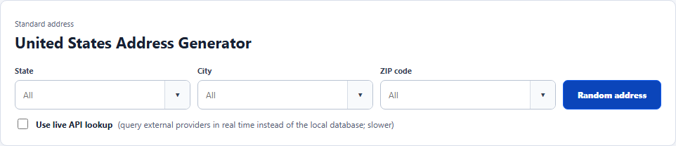</td>
    <td>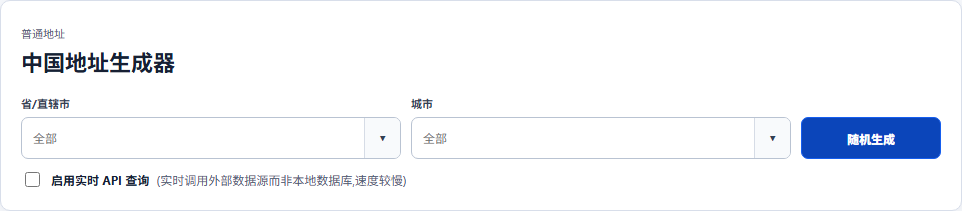</td>
  </tr>
  <tr>
    <th>Address</th>
    <th>Address</th>
  </tr>
  <tr>
    <td>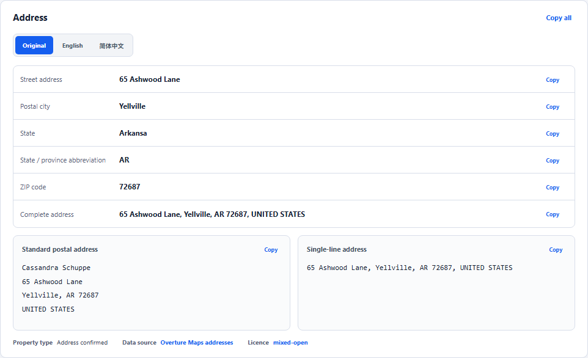</td>
    <td>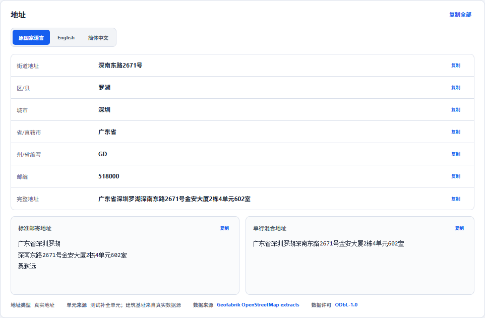</td>
  </tr>
  <tr>
    <th>Basic profile</th>
    <th>Basic profile</th>
  </tr>
  <tr>
    <td></td>
    <td></td>
  </tr>
  <tr>
    <th>Sandbox card</th>
    <th>Sandbox card</th>
  </tr>
  <tr>
    <td>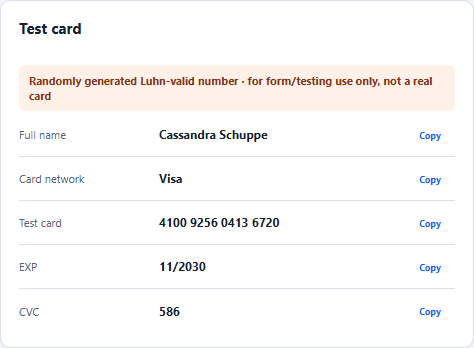</td>
    <td></td>
  </tr>
  <tr>
    <th>Employment</th>
    <th>Employment</th>
  </tr>
  <tr>
    <td></td>
    <td>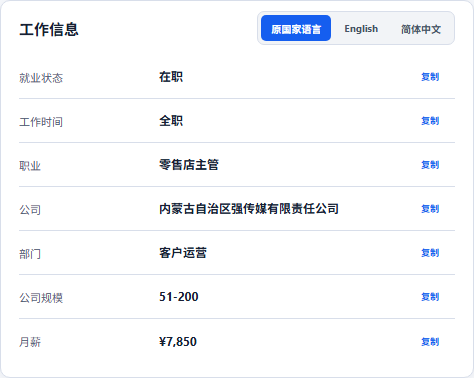</td>
  </tr>
  <tr>
    <th>Finance</th>
    <th>Finance</th>
  </tr>
  <tr>
    <td>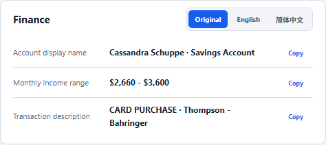</td>
    <td></td>
  </tr>
  <tr>
    <th>Network and extended fields</th>
    <th>Network and extended fields</th>
  </tr>
  <tr>
    <td>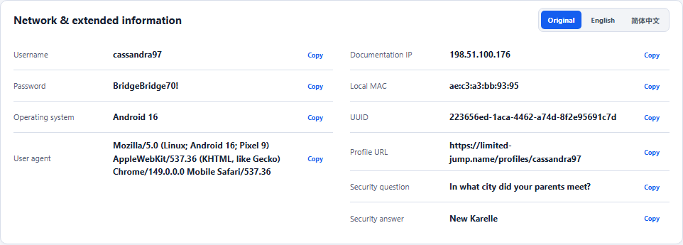</td>
    <td>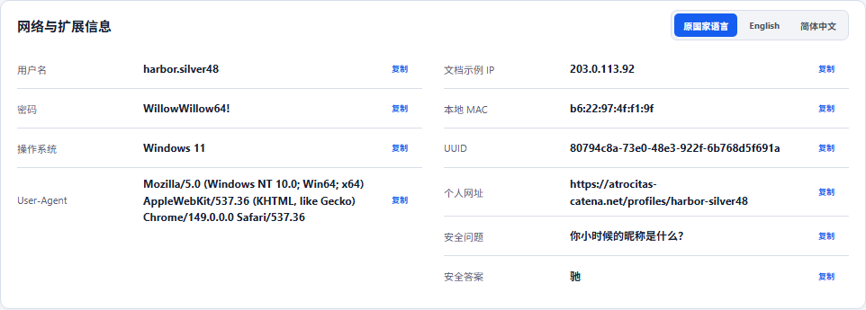</td>
  </tr>
  <tr>
    <th>Google Maps</th>
    <th>Google Maps</th>
  </tr>
  <tr>
    <td>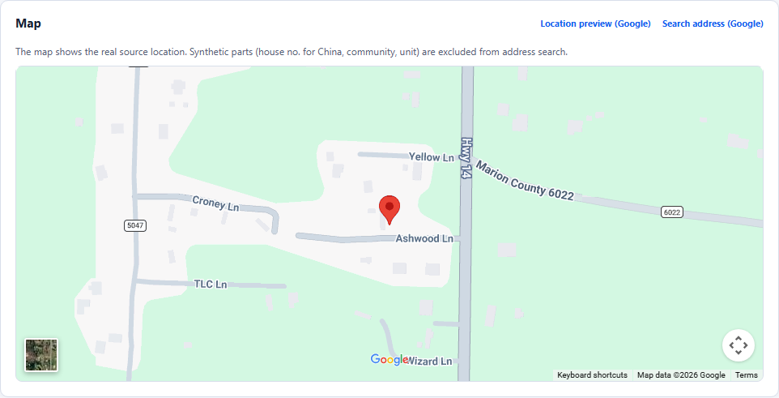</td>
    <td>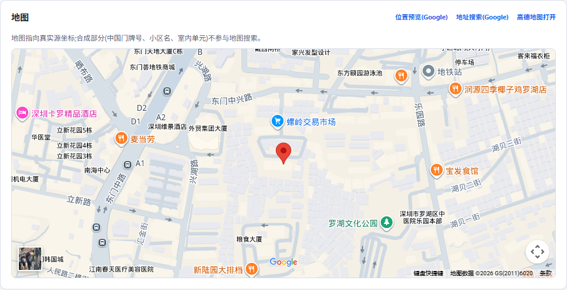</td>
  </tr>
</table>

</details>

## 📚 Documentation

| Document | Contents |
|---|---|
| [API documentation](docs/API.md) | Public endpoints, parameters, errors, sync management, CORS, and examples |
| [Deployment documentation](docs/DEPLOYMENT.md) | API keys, private configuration, VPS, Nginx, synchronization, backup, and capacity |
| [Development documentation](docs/DEVELOPMENT.md) | Architecture, local setup, data pipeline, extension points, tests, and release gates |

## ⚡ Quick start

Node.js 24 or newer is required.

```bash
git clone https://github.com/daimon3332/address.git
cd address
cp .env.example .env
npm ci
npm run db:migrate
npm run dev
```

A new database contains schema only. Run `npm run data:address-pool:bootstrap` for the resumable 27-country import. See the [deployment guide](docs/DEPLOYMENT.md) before running a production VPS.

## 🔑 Configuration summary

Offline runtime generation does not call map providers after synchronization. Configure multiple AMap, Baidu, and Tencent server keys in `/admin/`; they are encrypted in `control.sqlite` with the server-only `CONFIG_MASTER_KEY`. AMap browser display uses a separate domain-restricted JS API key and an encrypted server-side security code through `/_AMapService`. Put all real credentials only in ignored local/runtime configuration or encrypted administrator storage. Never add them to source, screenshots, issues, or CI logs.

## 💾 Database size

Measured after all 27 countries were synchronized on 2026-07-23 at commit `084805e`:

| Item | Measured size |
|---|---:|
| `address.sqlite` | 6.90 GiB |
| Complete `data/` directory | 7.89 GiB |
| Initial-import peak | About 11.2 GiB |

Actual size varies with upstream releases and WAL activity. A production application volume of at least **60 GiB** is recommended for synchronization, backups, and recovery space.

## 🌍 Coverage

United States, Canada, Mexico, United Kingdom, Germany, France, Italy, Spain, Netherlands, Russia, China, Hong Kong, Taiwan, Japan, South Korea, Singapore, Vietnam, Thailand, Philippines, Malaysia, India, Australia, Turkey, Saudi Arabia, Brazil, Nigeria, and South Africa.

## Data, privacy, and license

- [Overture Maps](https://overturemaps.org/) provides selected address records with source-specific metadata and terms.
- [OpenStreetMap](https://www.openstreetmap.org/copyright) and [Geofabrik](https://download.geofabrik.de/) provide other source data under ODbL 1.0.
- Client IP is used only for a requested location lookup and is not written to the address database.
- Address and indoor fields are source-backed; missing values remain empty. Profiles and card fields are synthetic test data.

Project code is released under the [MIT License](LICENSE). Redistributed data remains subject to its source licenses, attribution, and share-alike terms. The repository and releases contain no production database or private credentials.

## Community

- [linux.do](https://linux.do): **Learn AI on L-Station!!!**
- [Nodeseek.com](https://www.nodeseek.com): **Nodeseek is a place for people who love web development, hosting, vps / server and other geek things.**
