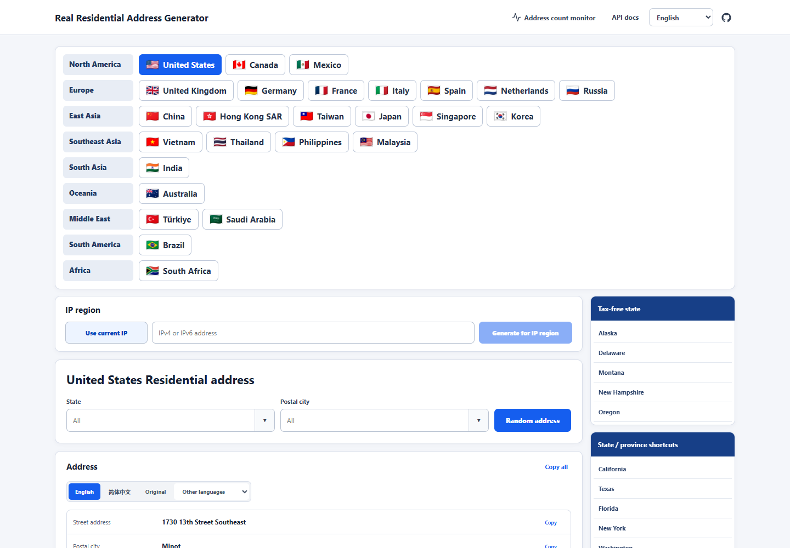
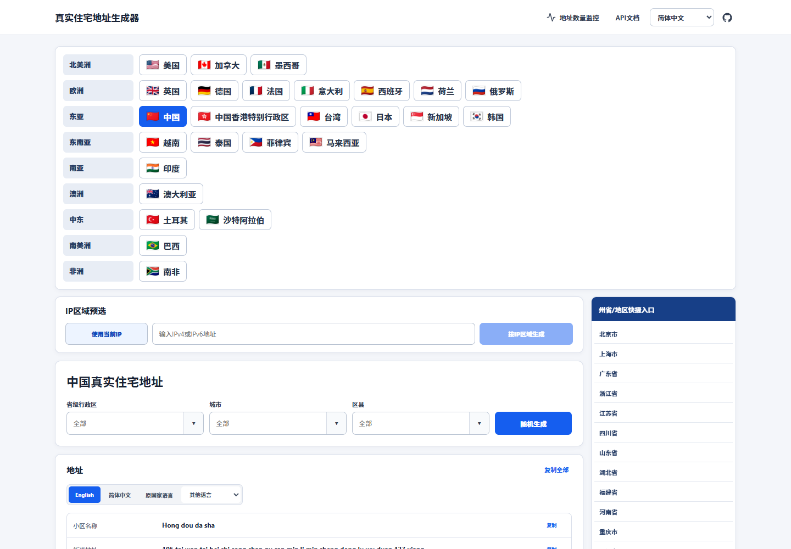
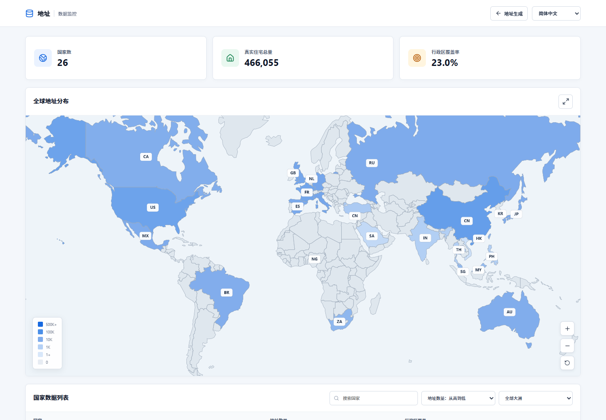
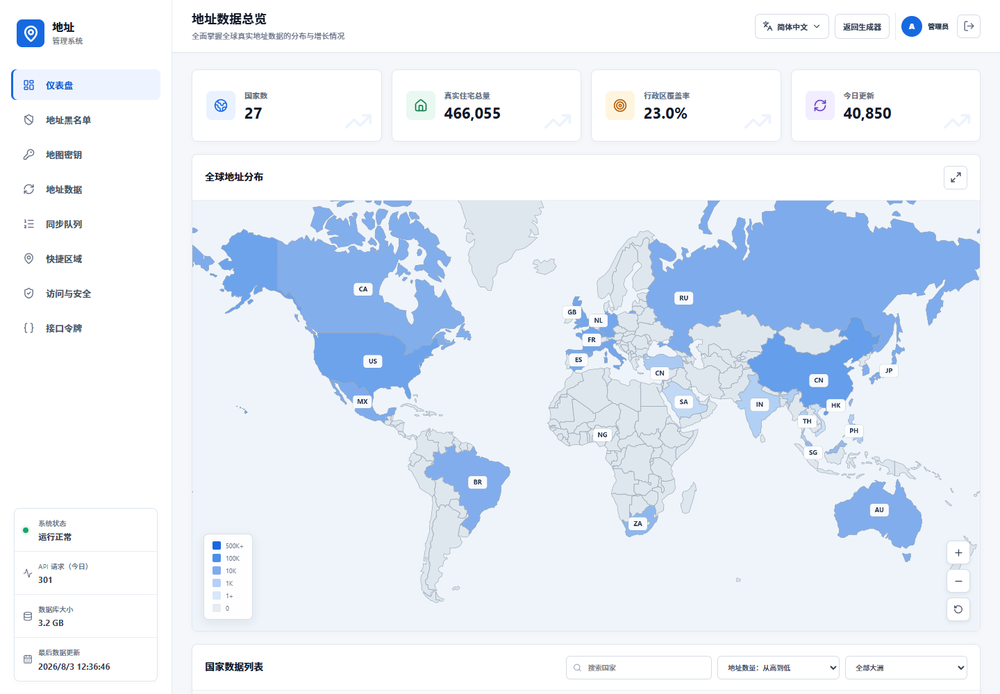
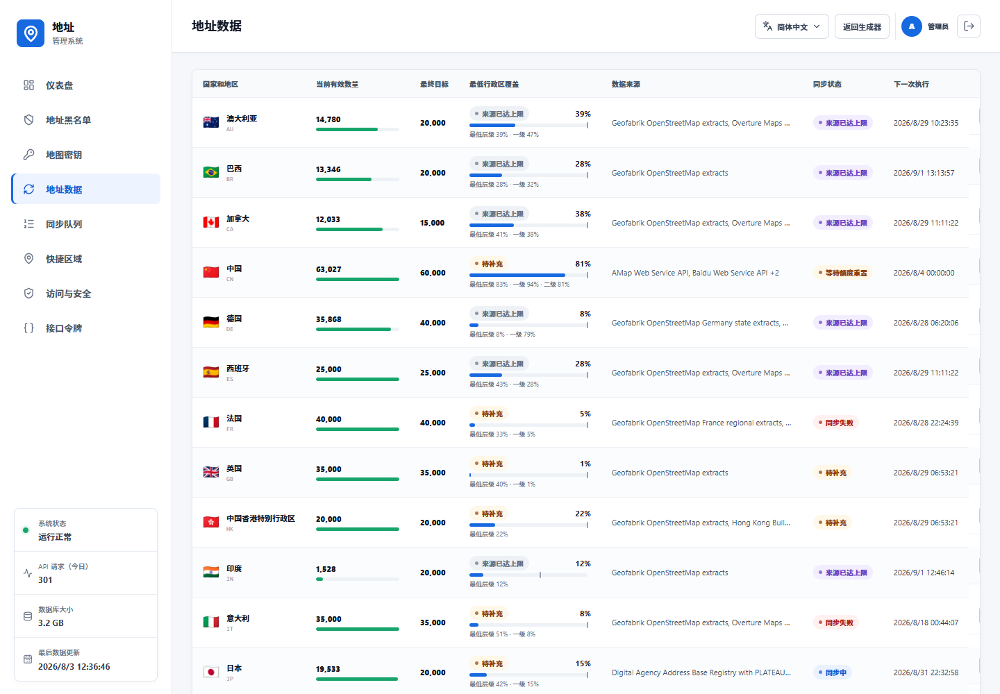
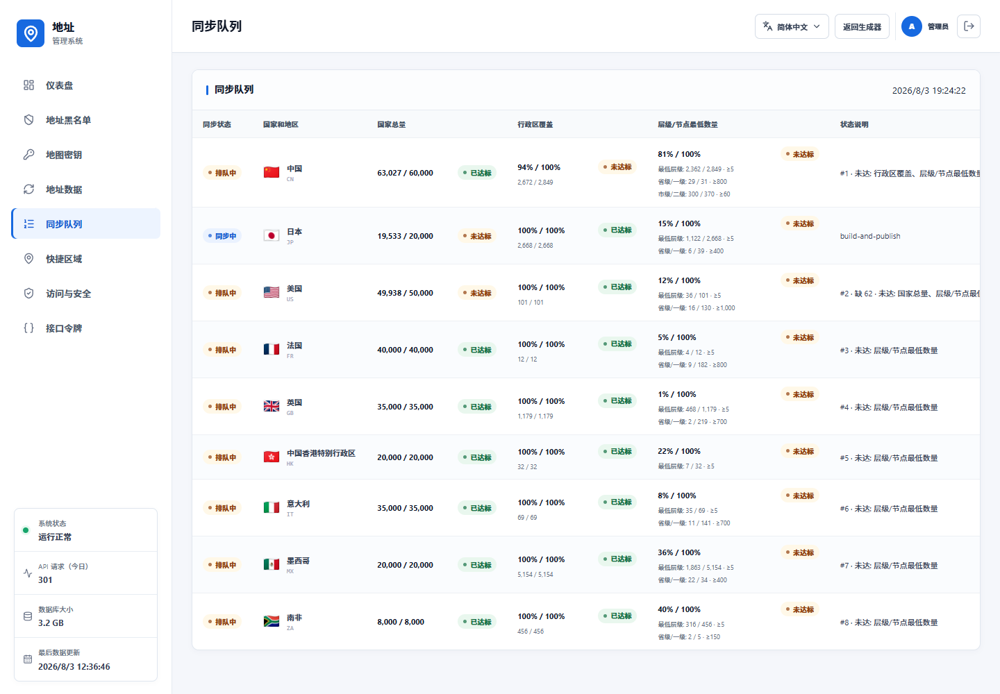
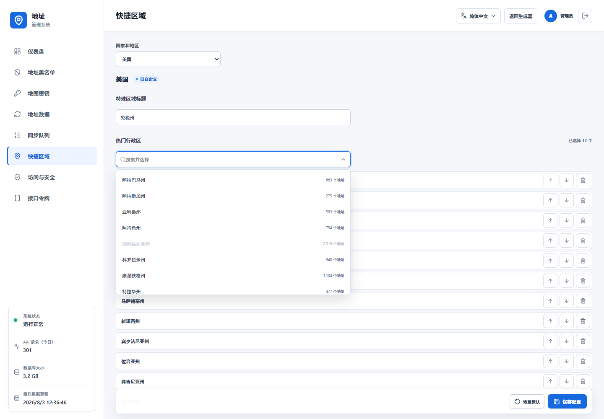
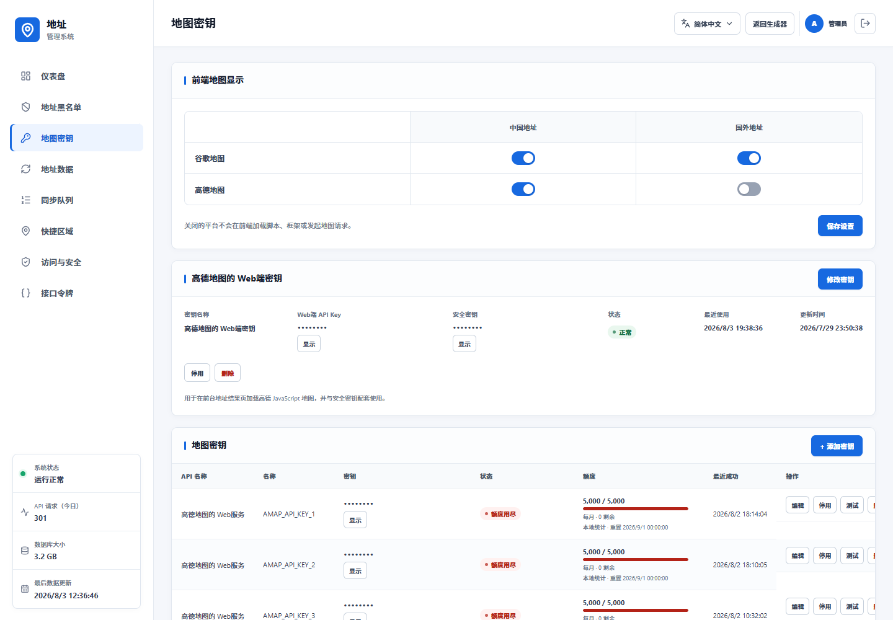

<p align="center"></p>
<h1 align="center">Address</h1>
<p align="center">基於 PostgreSQL 的自託管住宅位址與合成測試資料產生器</p>

<p align="center">
  <a href="README.md">English</a> · <a href="README.zh-CN.md">简体中文</a> · <a href="README.zh-TW.md">繁體中文</a>
</p>

<p align="center">
  <a href="https://github.com/daimon3332/address/actions/workflows/ci.yml"></a>
  <a href="https://nodejs.org/"></a>
  <a href="LICENSE"></a>
  <a href="https://address.333186.xyz"></a>
</p>

**一般部署完成後，應用程式與 PostgreSQL 位址資料庫大約占用 5 GB 磁碟空間；同步執行期間需要額外的暫存空間。**

## 核心功能

- 設定 27 個國家和地區，依實際行政結構提供州省、城市、區縣及郵遞區號篩選。
- 嚴格篩選：所選範圍沒有合格記錄時回傳錯誤，不會偷偷切換到其他地區。
- 從目前篩選範圍的全部合格位址快速隨機選擇，不會重複讀取資料庫前幾筆。
- 支援原文、英文、簡體中文、繁體中文、日語、韓語、德語、法語、西班牙語及葡萄牙語展示路徑。
- 位址語言和資料語言分別記憶；瀏覽器首次開啟預設 English，產生和切換國家不會重設選擇。
- 每個國家可設定熱門行政區、熱門城市與特殊區域；美國包含無州級銷售稅州。
- 提供公開覆蓋監控，以及管理員儀表板、位址資料規則、同步佇列、快捷區域、平台憑據、存取控制、黑名單與 API Token 頁面。
- 執行階段完全使用 PostgreSQL，包含連線池、交易發布、地區索引與預先建立的隨機位址索引。

## 支援範圍

| 區域 | 國家和地區 |
|---|---|
| 北美 | US、CA、MX |
| 歐洲 | GB、DE、FR、IT、ES、NL、RU |
| 東亞 | CN、HK、TW、JP、KR |
| 東南亞 | SG、MY、TH、PH、VN |
| 南亞 | IN |
| 大洋洲 | AU |
| 中東 | TR、SA |
| 南美 | BR |
| 非洲 | NG、ZA |

## 架構

```text
Astro 靜態頁面 + React 介面
             │
             ▼
       Hono Node.js API
        ├─ PostgreSQL 位址與控制資料
        ├─ 從 PostgreSQL 建立的隨機/篩選記憶體索引
        └─ 本地格式化、資料產生與選用翻譯

同步監督程序
        ├─ 可續跑的批次/API 適配器
        ├─ 依國家執行驗證與住宅證據門禁
        ├─ PostgreSQL 交易發布
        └─ 覆蓋統計與有界同步佇列
```

## 全自動同步規則

一個國家只有在所有已啟用規則都符合時才算完成：

1. 合格位址總量達到目標；
2. 最低行政層覆蓋率和每節點最低數量達標；
3. 已設定的一級、二級行政區最低數量達標；
4. 所有單節點覆蓋目標達標。

只達到國家總量不能標記完成。若資料源已被證明耗盡，該國家仍顯示未完成，但不會重複進入執行佇列；只有來源或版本指紋變更後才重新評估。

佇列包含有限重試、指數退避、額度/冷卻恢復時間、無增長鎖存及連續失敗暫停，因此不會對同一個沒有變化的資料源無限循環。中國在仍具備同步條件時擁有最高自動優先權。

## 介面截圖

<table>
  <tr><th>美國產生介面</th><th>中國產生介面</th></tr>
  <tr>
    <td></td>
    <td></td>
  </tr>
</table>

### 資料監控



### 管理員介面

<table>
  <tr><th>儀表板</th><th>位址資料</th></tr>
  <tr>
    <td></td>
    <td></td>
  </tr>
  <tr><th>同步佇列</th><th>快捷區域</th></tr>
  <tr>
    <td></td>
    <td></td>
  </tr>
</table>



## 快速開始

需要 Node.js 24+、Docker Compose，以及足以容納所選資料源的磁碟空間。

```bash
git clone https://github.com/daimon3332/address.git
cd address

cd ops/postgresql
POSTGRES_PASSWORD='REPLACE_WITH_A_STRONG_PASSWORD' docker compose up -d
cd ../..

cp .env.example .env
# 在 .env 設定 POSTGRES_URL、CONFIG_MASTER_KEY、ADMIN_BOOTSTRAP_PASSWORD。
npm ci
npm run db:migrate
npm run build
npm start
```

新資料庫只有結構。匯入資料前應先檢查對應國家的授權、資源需求與策略文件。生產部署、程序監督、反向代理、備份與還原見[部署文件](docs/DEPLOYMENT.zh-TW.md)。

## 設定與 API Key

- 複製 `.env.example`，絕不提交 `.env`。
- 平台金鑰預設為選用；只有選定同步策略需要時才必須設定。
- 多個 Key 獨立輪換。目前 Key 失敗時先冷卻並嘗試其他 Key；全部不可用時等待最早恢復時間。
- 後台加密憑據依賴穩定的 `CONFIG_MASTER_KEY`。
- 各平台申請入口、變數名稱、限制與輪換規則見獨立的 [API Key 設定文件](docs/API_KEYS.zh-TW.md)。

## 文件

| 文件 | 內容 |
|---|---|
| [API 文件](docs/API.zh-TW.md) | Bearer 驗證、產生、篩選、錯誤與監控 |
| [API Key](docs/API_KEYS.zh-TW.md) | 平台申請、環境變數、加密、輪換與冷卻 |
| [部署文件](docs/DEPLOYMENT.zh-TW.md) | PostgreSQL、VPS 目錄、程序、Nginx、備份、還原與升級 |
| [開發文件](docs/DEVELOPMENT.zh-TW.md) | 架構、本地檢查、擴充點與發布門禁 |
| [位址格式](docs/address-formats.md) | 各國格式與欄位行為 |
| [國家策略](docs/strategies/) | 資料源、證據、座標、去重、驗證與更新策略 |

## 授權

專案原始碼使用 [MIT](LICENSE)。上游資料集保留各自的授權與署名要求。
